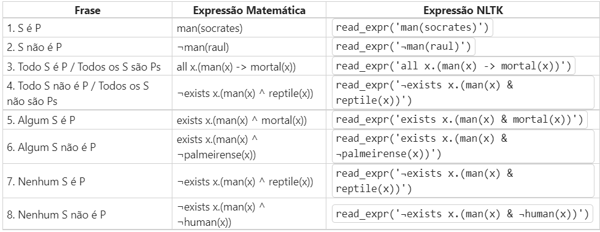

# Lógica Proposicional e Quantificacional
## introdução
Esse repositório contém uma implementação simples de lógica proposicional e quantificacional. Nesse código, é possível criar bases de crenças e neles adicionar suas crenças, seguindo alguns formatos de frases que foram pré-determinados: 
    

Você pode adicionar frases que seguem esses dez casos que estão na coluna 'frase' para preencher a sua base de crenças da forma que você quiser. Apesar de não estar representado na tabela você pode usar também substantivos femininos, e portanto pode usar também 'Alguma', 'Todas', 'Toda' e 'Nenhuma' nas suas frases. Para isso tudo funcionar, nos criamos um tradutor que transforma o texto da linguagem humana para a linguagem que a biblioteca nltk utiliza, podemos ver isso representado nas outras duas colunas da tabela. 

## Regras da base de crenças

O popósito da base de crenças e basicamente garantir que uma série de crenças não seja conflitantes entre eles, de uma forma que, uma crença só pode ser adicionada a base se não tiver nenhum tipo de conflito com as crenças que já se encontram na base: 

